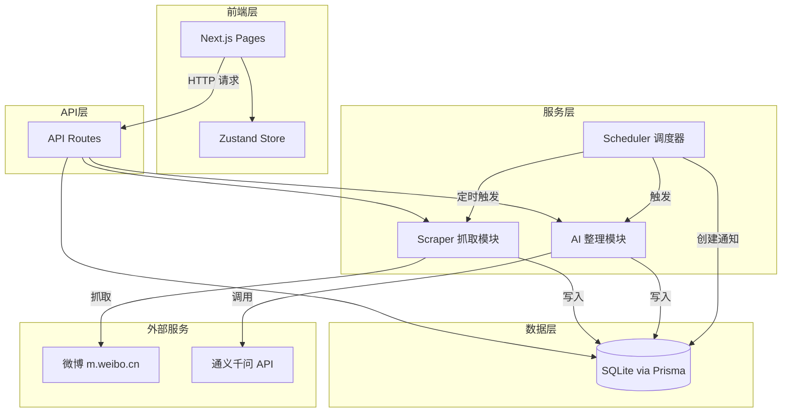

# 设计文档

## 概述

微博每日摘要系统是一个基于 Next.js 的全栈应用。系统通过定时任务自动抓取用户关注的微博博主内容，调用通义千问 API 生成结构化摘要，并以站内消息形式推送给用户。前端使用 shadcn/ui 组件库提供博主管理、摘要浏览、消息通知和配置管理等界面。

技术栈：
- 前端：Next.js App Router + shadcn/ui + Zustand
- 后端：Next.js API Routes (Node.js)
- 数据库：SQLite + Prisma ORM
- AI：通义千问（Dashscope 兼容 OpenAI SDK）
- 定时任务：node-cron

## 架构



系统分为四层：
- **前端层**：Next.js 页面 + Zustand 状态管理，负责用户交互
- **API 层**：Next.js API Routes，处理 CRUD 请求和业务逻辑入口
- **服务层**：Scraper（微博抓取）、AI（摘要生成）、Scheduler（定时调度）
- **数据层**：SQLite 数据库，通过 Prisma ORM 访问

## 组件与接口

### 前端页面结构

```
app/
├── page.tsx                  # 首页 - 今日摘要 + 立即抓取按钮
├── bloggers/page.tsx         # 博主管理页 - 添加/删除/列表
├── history/
│   ├── page.tsx              # 历史摘要列表 - 分页 + 博主筛选
│   └── [id]/page.tsx         # 摘要详情 - Markdown 渲染 + 原始链接
├── settings/page.tsx         # 用户配置页 - 推送时间 + AI 风格
├── layout.tsx                # 全局布局 - 导航栏 + 消息角标
```

### 核心前端组件

| 组件 | 位置 | 说明 |
|------|------|------|
| NotificationBell | components/NotificationBell.tsx | 消息角标 + Popover 通知列表 |
| BloggerCard | components/BloggerCard.tsx | 博主卡片（头像、名称、删除按钮） |
| DigestCard | components/DigestCard.tsx | 摘要卡片（日期、摘要预览） |
| BloggerFilter | components/BloggerFilter.tsx | 博主筛选下拉选择器 |

### API 接口

| 方法 | 路径 | 说明 | 请求体/参数 | 响应 |
|------|------|------|-------------|------|
| GET | /api/bloggers | 获取博主列表 | - | Blogger[] |
| POST | /api/bloggers | 添加博主 | { uid: string } | Blogger \| Error |
| DELETE | /api/bloggers/[id] | 删除博主及关联 Post | - | { success: true } |
| POST | /api/scrape | 手动触发抓取 | - | { message: string } |
| GET | /api/digests | 获取摘要列表 | ?page=1&bloggerId=xxx | { data: Digest[], total: number } |
| GET | /api/digests/[id] | 获取摘要详情 | - | Digest |
| GET | /api/notifications | 获取通知列表 + 未读数 | - | { notifications: Notification[], unreadCount: number } |
| PATCH | /api/notifications/[id] | 标记通知为已读 | - | Notification |
| GET | /api/settings | 获取配置 | - | Settings |
| PUT | /api/settings | 更新配置 | { pushTime: string, aiStyle: string } | Settings \| Error |

### 前端状态管理（Zustand）

```typescript
// store/useNotificationStore.ts
interface NotificationStore {
  unreadCount: number;
  notifications: Notification[];
  fetchNotifications: () => Promise<void>;
  markAsRead: (id: string) => Promise<void>;
}

// store/useBloggerStore.ts
interface BloggerStore {
  bloggers: Blogger[];
  fetchBloggers: () => Promise<void>;
  addBlogger: (uid: string) => Promise<void>;
  removeBlogger: (id: string) => Promise<void>;
}
```

## 数据模型

### Blogger（博主）

```prisma
model Blogger {
  id        String   @id @default(cuid())
  uid       String   @unique   // 微博 UID，唯一标识
  name      String             // 博主昵称
  avatar    String?            // 头像 URL
  createdAt DateTime @default(now())
  posts     Post[]
}
```

### Post（原始微博）

```prisma
model Post {
  id          String   @id @default(cuid())
  bloggerId   String
  blogger     Blogger  @relation(fields: [bloggerId], references: [id], onDelete: Cascade)
  weiboId     String   @unique  // 微博原始 ID，用于去重
  content     String            // 正文内容
  publishedAt DateTime          // 发布时间
  url         String            // 原始微博链接
  createdAt   DateTime @default(now())
}
```

### Digest（摘要）

```prisma
model Digest {
  id        String   @id @default(cuid())
  date      String   @unique    // 日期 YYYY-MM-DD，每天最多一条
  content   String?             // AI 生成的摘要 Markdown，failed 时为 null
  rawPostIds String             // 关联的 Post ID 列表（JSON 数组字符串）
  status    String   @default("pending")  // pending | done | failed
  createdAt DateTime @default(now())
  notification Notification?
}
```

### Notification（站内消息）

```prisma
model Notification {
  id        String   @id @default(cuid())
  digestId  String?  @unique    // 关联 Digest，"今日无新动态"时为 null
  digest    Digest?  @relation(fields: [digestId], references: [id])
  title     String              // 通知标题
  isRead    Boolean  @default(false)
  createdAt DateTime @default(now())
}
```

### Settings（配置）

```prisma
model Settings {
  id       String @id @default("singleton")  // 单例模式
  pushTime String @default("08:00")          // HH:mm 格式
  aiStyle  String @default("concise")        // concise | detailed
}
```

### 核心模块实现思路

#### 微博抓取模块（lib/scraper.ts）

使用 `axios` 请求微博移动版 API（m.weibo.cn/api/container/getIndex），解析返回的 JSON 数据提取微博列表。

```typescript
async function scrapeBlogger(blogger: Blogger): Promise<RawPost[]> {
  // 1. 请求 https://m.weibo.cn/api/container/getIndex?uid={uid}&containerid=107603{uid}
  // 2. 解析 JSON 中的 data.cards，提取微博 ID、正文、时间、链接
  // 3. 查询数据库已有 weiboId，过滤重复
  // 4. 返回新微博列表
}

async function scrapeAll(): Promise<{ success: string[], failed: string[] }> {
  // 遍历所有博主，逐个调用 scrapeBlogger
  // 单个博主失败不影响其他博主，记录错误日志
  // 返回成功和失败的博主 ID 列表
}
```

#### AI 整理模块（lib/ai.ts）

调用通义千问 API（兼容 OpenAI SDK 格式）：

```typescript
import OpenAI from 'openai';

const client = new OpenAI({
  apiKey: process.env.DASHSCOPE_API_KEY,
  baseURL: 'https://dashscope.aliyuncs.com/compatible-mode/v1',
});

function buildPrompt(posts: Post[], style: 'concise' | 'detailed'): string {
  // 按博主分组，格式化为 prompt
  // style 影响 prompt 中的指令（简洁摘要 vs 详细分析）
}

async function generateDigest(posts: Post[], style: 'concise' | 'detailed'): Promise<string> {
  const prompt = buildPrompt(posts, style);
  const response = await client.chat.completions.create({
    model: 'qwen-turbo',
    messages: [{ role: 'user', content: prompt }],
  });
  return response.choices[0].message.content;
}
```

#### 定时任务调度器（lib/scheduler.ts）

```typescript
import cron from 'node-cron';

let currentTask: cron.ScheduledTask | null = null;

function startScheduler(pushTime: string) {
  if (currentTask) currentTask.stop();
  const [hour, minute] = pushTime.split(':');
  currentTask = cron.schedule(`${minute} ${hour} * * *`, async () => {
    // 1. 抓取所有博主最新内容
    // 2. 读取 Settings 获取 aiStyle
    // 3. 调用 AI 生成摘要，写入 Digest
    // 4. 创建 Notification（有内容则关联 Digest，无内容则"今日无新动态"）
  });
}
```

#### 配置验证（lib/validation.ts）

```typescript
function validatePushTime(time: string): boolean {
  // 验证 HH:mm 格式，00:00 - 23:59
  return /^([01]\d|2[0-3]):[0-5]\d$/.test(time);
}

function validateAiStyle(style: string): boolean {
  return ['concise', 'detailed'].includes(style);
}
```

## 正确性属性

*属性是在系统所有有效执行中都应成立的特征或行为——本质上是对系统应该做什么的形式化描述。属性是人类可读规范与机器可验证正确性保证之间的桥梁。*

### Property 1: 博主添加 round-trip

*对于任意*合法的微博 UID，添加博主后查询博主列表，应包含一条记录，其 UID、昵称字段与添加时提供的信息一致。

**Validates: Requirements 1.1, 1.2**

### Property 2: 博主级联删除

*对于任意*博主及其关联的 Post 记录，删除该博主后，数据库中不应存在该博主的记录，也不应存在其关联的任何 Post 记录。

**Validates: Requirements 1.3**

### Property 3: 重复 UID 拒绝

*对于任意*已存在于博主列表中的 UID，再次添加时应返回错误，且博主列表长度不变。

**Validates: Requirements 1.5**

### Property 4: 微博去重

*对于任意*包含重复 weiboId 的微博列表，经过抓取入库后，数据库中每个 weiboId 最多出现一次。

**Validates: Requirements 2.3**

### Property 5: 抓取故障隔离

*对于任意*博主集合，如果其中部分博主抓取失败，其余成功博主的微博仍应正常存入数据库。

**Validates: Requirements 2.4**

### Property 6: Prompt 完整性

*对于任意*微博列表，`buildPrompt` 生成的字符串应包含每条微博的发布时间、正文内容和原始链接，且内容按博主分组组织。

**Validates: Requirements 3.2, 3.3, 3.5**

### Property 7: 摘要失败状态处理

*对于任意* AI 调用失败的情况，Digest 的 status 应为 "failed"，且关联的原始 Post 数据应完整保留在数据库中。

**Validates: Requirements 3.4**

### Property 8: 未读数一致性

*对于任意*时刻，API 返回的 unreadCount 应等于数据库中 isRead=false 的 Notification 记录数量。

**Validates: Requirements 4.4**

### Property 9: 标记已读幂等性

*对于任意* Notification，将其标记为已读一次和标记多次，结果应相同（isRead 始终为 true，未读总数不会变为负数）。

**Validates: Requirements 4.6**

### Property 10: 摘要列表排序

*对于任意*摘要数据集，GET /api/digests 返回的列表应严格按 date 字段降序排列。

**Validates: Requirements 5.1**

### Property 11: 配置保存 round-trip

*对于任意*合法的配置对象（pushTime 为 HH:mm 格式，aiStyle 为 concise 或 detailed），PUT 保存后 GET 读取应得到完全相同的值。

**Validates: Requirements 6.4**

### Property 12: 配置验证正确性

*对于任意*字符串作为 pushTime 输入，validatePushTime 应在且仅在输入匹配 HH:mm 格式（00:00-23:59）时返回 true；对于不合法的输入，系统应返回验证错误信息。

**Validates: Requirements 6.3, 6.5**

## 错误处理

| 场景 | 处理方式 |
|------|----------|
| 微博抓取单个博主失败 | 记录该博主的错误日志，继续抓取其他博主，返回失败博主列表 |
| 通义千问 API 调用失败 | Digest status 设为 "failed"，保留原始 Post 数据，可后续重试 |
| 数据库写入失败 | 返回 HTTP 500，前端展示错误提示 |
| 博主 UID 不存在（微博平台） | 返回 HTTP 400，错误信息"博主不存在" |
| 博主 UID 重复添加 | 返回 HTTP 400，错误信息"该博主已添加" |
| 配置值不合法 | 返回 HTTP 400，包含具体的验证错误字段和原因 |
| 推送时无新内容 | 创建"今日无新动态"Notification，digestId 为 null |

## 测试策略

### 单元测试（Jest）

- 测试 `lib/scraper.ts` 的数据解析和去重逻辑（mock HTTP 响应）
- 测试 `lib/ai.ts` 的 `buildPrompt` 函数（验证 prompt 包含所有必要信息）
- 测试 `lib/validation.ts` 的配置验证函数
- 测试 API 路由的输入验证和错误处理逻辑
- 测试 Zustand store 的状态管理逻辑

### 属性测试（fast-check）

使用 `fast-check` 库进行属性测试，每个属性测试运行最少 100 次随机输入。

每个正确性属性对应一个独立的属性测试：

| 属性 | 测试内容 | 标注 |
|------|----------|------|
| Property 1 | 生成随机 UID，添加博主后验证可查询到且字段完整 | Feature: weibo-daily-digest, Property 1: 博主添加 round-trip |
| Property 2 | 生成随机博主和关联 Post，删除博主后验证级联清除 | Feature: weibo-daily-digest, Property 2: 博主级联删除 |
| Property 3 | 生成随机已存在 UID，重复添加验证被拒绝且列表不变 | Feature: weibo-daily-digest, Property 3: 重复 UID 拒绝 |
| Property 4 | 生成含重复 weiboId 的微博列表，验证入库后无重复 | Feature: weibo-daily-digest, Property 4: 微博去重 |
| Property 5 | 生成部分失败的博主集合，验证成功博主的数据完整 | Feature: weibo-daily-digest, Property 5: 抓取故障隔离 |
| Property 6 | 生成随机微博列表，验证 buildPrompt 输出包含所有必要信息 | Feature: weibo-daily-digest, Property 6: Prompt 完整性 |
| Property 7 | 模拟 AI 失败，验证 Digest status 为 failed 且 Post 保留 | Feature: weibo-daily-digest, Property 7: 摘要失败状态处理 |
| Property 8 | 随机创建/标记通知，验证 unreadCount 与数据库一致 | Feature: weibo-daily-digest, Property 8: 未读数一致性 |
| Property 9 | 对同一通知多次标记已读，验证结果幂等 | Feature: weibo-daily-digest, Property 9: 标记已读幂等性 |
| Property 10 | 生成随机日期的摘要集合，验证返回列表按日期降序 | Feature: weibo-daily-digest, Property 10: 摘要列表排序 |
| Property 11 | 生成随机合法配置，保存后读取验证值一致 | Feature: weibo-daily-digest, Property 11: 配置保存 round-trip |
| Property 12 | 生成随机字符串，验证 validatePushTime 正确区分合法/非法格式 | Feature: weibo-daily-digest, Property 12: 配置验证正确性 |

### 测试标注格式

每个属性测试必须包含注释：`// Feature: weibo-daily-digest, Property N: {属性标题}`
